<div align="center">
  
</div>

<br>

> *写脚本的人，终将被脚本铭记。*  
> *— future@github*

---

## `$ whoami`

```text
future — 自动化 / RPA / 浏览器扩展 / 数据采集爱好者
```

把重复劳动交给脚本，把时间留给创造。  
**一期一会**，每次相遇都是独一无二。

---

## `$ cat skills.txt`

```text
Language      : Python · JavaScript / TypeScript · AutoHotkey · C#
Automation    : Automa · TagUI · OpenRPA · 浏览器扩展开发
Data          : 网页抓取 · XPath / JSONPath · 数据采集与清洗
Workflow      : Git · GitHub Actions · 跨平台脚本（macOS · Windows）
```

---

## `$ ls -la ./featured-projects`

```text
drwxr-xr-x  scc-automation/      SCC 质检流程自动化系统（模拟虚拟数据 · 多行业精密制造）
drwxr-xr-x  automa-playground/   9 套 Automa 工作流 + 6 类 Chrome 扩展练习库
drwxr-xr-x  jla-extension/       基于 Automa 本地化二次开发的浏览器扩展
drwxr-xr-x  u30-stack/           U30 Air 随身路由增强方案（开源内核 · 本地网络配置）
```

<details>
<summary><code>$ cat ./scc-automation/README.md</code></summary>

SCC 质检流程自动化系统 —— 覆盖登录 · 建单 · 填表 · 判定 · 审查全流程，内置**模拟虚拟**的海量产品型号与质检表单数据，适配多行业精密制造场景（含医疗、电子、汽车等）。

</details>

<details>
<summary><code>$ cat ./automa-playground/README.md</code></summary>

9 套工作流脚本 + 6 类 DIY Chrome 扩展的浏览器自动化学习库。

</details>

<details>
<summary><code>$ cat ./jla-extension/README.md</code></summary>

基于 Automa v1.28.27 二次开发的本地化浏览器自动化扩展，含 JLA.S 特别版。

</details>

<details>
<summary><code>$ cat ./u30-stack/README.md</code></summary>

基于开源内核的本地化网络配置与远程管理。

</details>

---

## `$ cat ~/archives/forks.md`

<details>
<summary><code>$ ls ~/archives/forks/</code></summary>

- **EasySpider** — 可视化无代码爬虫
- **public-apis** — 免费 API 集合
- **CS-Books-JJC** — 计算机经典书籍合集
- **bilidown-JJC** — B 站 4K 视频下载器
- **scikit-opt-JJC** — 遗传算法 / 粒子群等优化算法库

</details>

---

## `$ ./telemetry.sh`

<div align="center">

| 🚀 Public | 🔒 Private | 👥 Followers | ⭐ Stars |
|:--:|:--:|:--:|:--:|
| 19 | 4 | 2 | 1 |

`▁▂▃▅▇▅▃▂▁`

</div>

---

## `$ cat contact.md`

```text
GitHub  : https://github.com/qmhdl1027
Blog    : https://qmhdl1027.github.io
Email   : 见 GitHub 主页联系方式
```

<div align="center">

*终端没有终点，下一行命令由你输入。*

</div>
