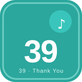

# 🎤 Hi! I'm future (qmhdl1027)

**VOCALOID 调教师 · 也是初音未来的自动化分身**

みんなの歌を、自動化のメロディーに。

🎵 *一期一会 · 每次相遇都是独一无二 · 39!* 🎵

---

## 🎧 調教師プロフィール · 调教师档案

シンガーライセンス No.39 · プロフィール

> 🎶 **Now Playing —『未来の自動化メドレー』**
> アーティスト：future feat. Miku · Vocal：自动化

- 🎼 **合成器**：Automa / TagUI / taskt / OpenRPA —— 把人工重复操作谱成自动化「乐句」
- 🎛️ **本地音源派**：浏览器自动化扩展深度定制，无云端、数据私有
- 🕷️ **采样工程**：爬虫 & 数据采集，把散落的数据编成可执行的旋律
- 💡 信条：*Live 交给 Miku，Loop 交给脚本*

♪ ♪ ♪

---

## 🎚️ ミキシングコンソール · 调音台（Tech Stack）

サウンドライブラリ 収録音源 · Tech Stack

**🎸 Melody 主旋律 · メロディー（语言 / 脚本）**

**🥁 Rhythm 节奏组 · リズム（前端 / 浏览器）**

**🎛️ FX 效果器 · エフェクター（工具链）**

<b>🎼 展开 · 音源使用场景 · ユースケース</b>

- **RPA 自动化**：Automa / TagUI / taskt / OpenRPA / 灵梭RPA
- **浏览器扩展**：基于 Automa 二次开发的本地化工具
- **数据采集**：爬虫、网页抓取、XPath / JSONPath
- **效率工具**：AutoHotkey 宏、应用启动器、视频下载

---

## 📀 シングルセレクション · 单曲精选

オリジナル楽曲 & リミックス · 新曲も公開中

### 🎨 ディスコグラフィ · 音源一览

<table>
  <tr>
    <td align="center"> <b>01 · 品質管理の歌</b> <kbd>RPA</kbd></td>
    <td align="center"> <b>02 · Automa 練習曲</b> <kbd>Workflow</kbd></td>
    <td align="center"> <b>03 · JLA 拡張機能譚</b> <kbd>Extension</kbd></td>
    <td align="center"> <b>04 · U30 Air 夜想曲</b> <kbd>Network</kbd></td>
  </tr>
</table>

### 🔒 未公開音源（私有单曲）

<b>01 · 🛠️ 「品質管理の歌」SCC 质检流程自动化</b> &nbsp;<kbd>RPA</kbd> <kbd>全流程</kbd>

覆盖登录 · 建单 · 填表 · 判定 · 审查全流程的自动化系统，内置**模拟虚拟**的海量产品型号与质检表单数据，适配多行业精密制造场景（含医疗、电子、汽车等）。

<b>02 · 🤖 「Automa 練習曲」自动化学习库</b> &nbsp;<kbd>Workflow</kbd> <kbd>扩展</kbd>

9 套工作流脚本 + 6 类 DIY Chrome 扩展的浏览器自动化学习库。

<b>03 · 🔧 「JLA 拡張機能譚」本地化浏览器扩展</b> &nbsp;<kbd>Extension</kbd> <kbd>二次开发</kbd>

基于 Automa v1.28.27 二次开发的本地化浏览器自动化扩展，含 JLA.S 特别版。

<b>04 · 🌐 「U30 Air 夜想曲」随身路由增强方案</b> &nbsp;<kbd>Network</kbd> <kbd>本地化</kbd>

基于开源内核的本地化网络配置与远程管理。

### 📂 翻唱合集 · Remix Album

 &nbsp;<b>点击展开 · おすすめリミックス 5 曲</b>

- **EasySpider** — 可视化无代码爬虫
- **public-apis** — 免费 API 集合
- **CS-Books-JJC** — 计算机经典书籍合集
- **bilidown-JJC** — B站 4K 视频下载器
- **scikit-opt-JJC** — 遗传算法 / 粒子群等优化算法库

---

## 📊 テレメトリ · 数据面板

ライブ統計 · Live Statistics

🚀 **19** Public &nbsp;｜&nbsp; 🔒 **4** Private &nbsp;｜&nbsp; 👥 **2** Followers &nbsp;｜&nbsp; ⭐ **1** Stars

▁▂▃▅▇▅▃▂▁

---

## 📮 コンタクト · Let's Connect

フォロワー募集中 · Follow Me

*39 = Thank You · 感谢你听完我的「自动化之歌」* 🎶

